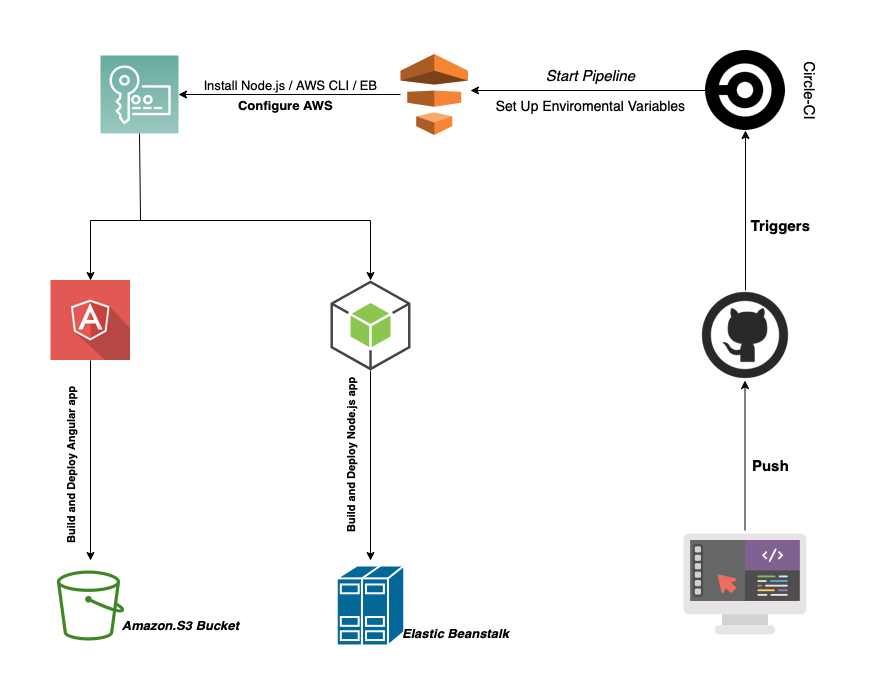
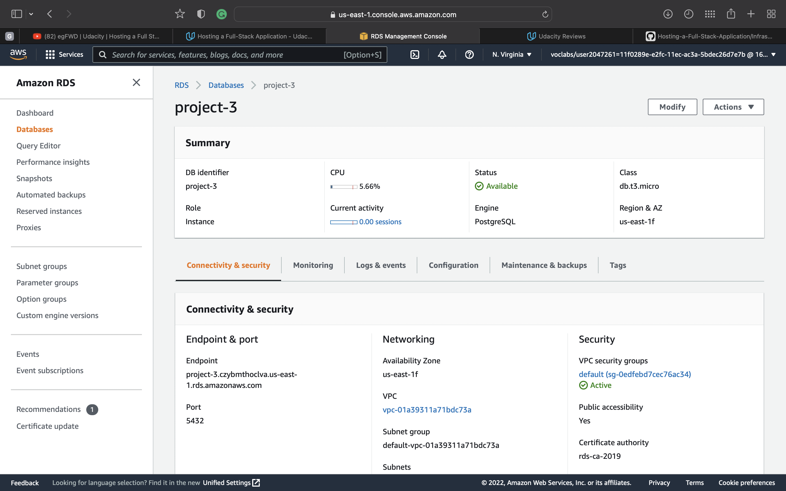
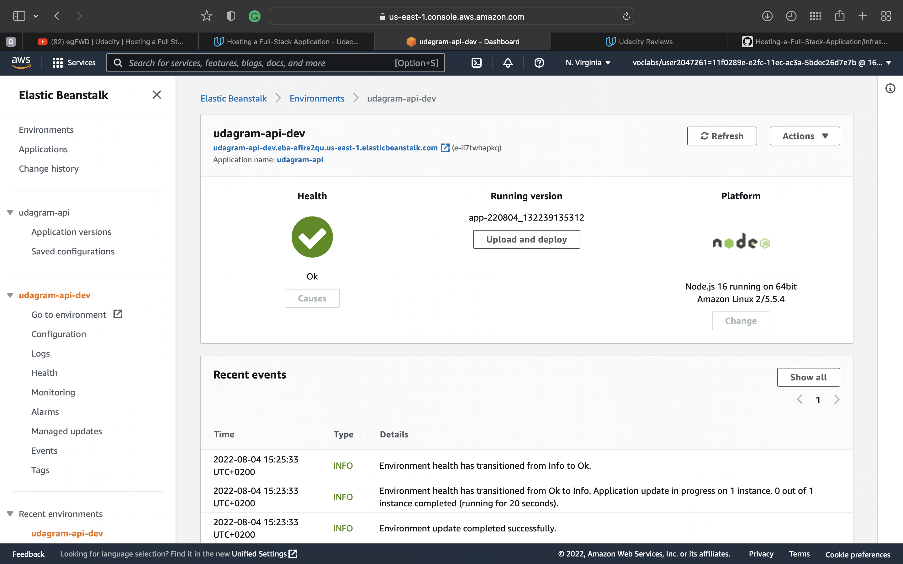
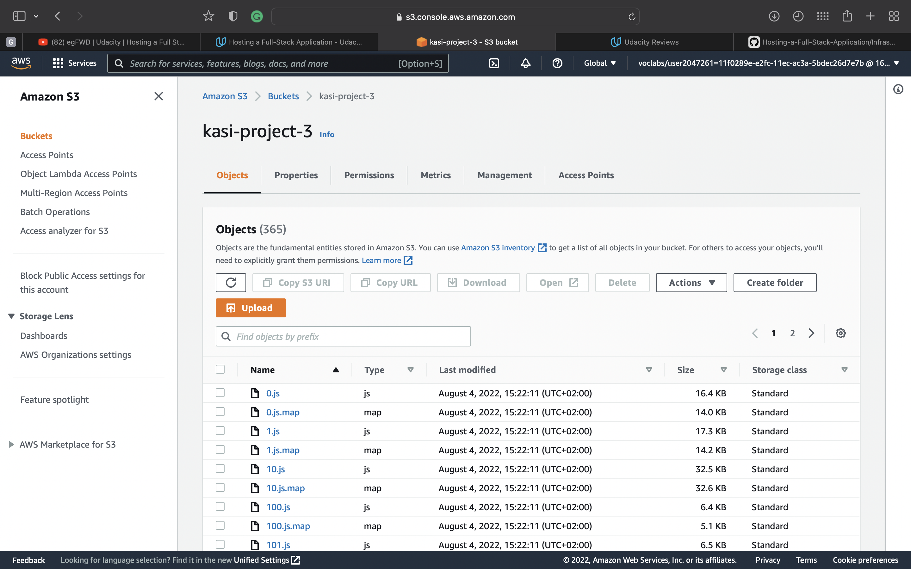

## Architecture Diagram

---

## Database: RDS DB

The application server uses AWS RDS Postgres as database for storing and retrieving information.

Database URI:

- postgres://postgres:akasiakasi7yz@[project-3.czybmthoclva.us-east-1.rds.amazonaws.com](project-3.czybmthoclva.us-east-1.rds.amazonaws.com):5432/postgres

  

---

## Elastic Beanstalk

The application server is deployed on AWS Elastic Beanstalk service. The application is build, archived and uploaded
to and S3 bucket from where Elastic Beanstalk extracts and runs the application on an endpoint.

EB URL: [http://udagram-api-dev.eba-afire2qu.us-east-1.elasticbeanstalk.com](http://Udagramfullstack-env.eba-aa8qagsp.us-east-1.elasticbeanstalk.com)

---

## S3 Bucket

The frontend application is deployed using AWS S3 Bucket. The bundled assets are uploaded to an S3 bucket and that
bucket is made publicly readable.

S3 Bucket URL: [http://kasi-project-3.s3-website-us-east-1.amazonaws.com/](http://kasi-project-3.s3-website-us-east-1.amazonaws.com/)

