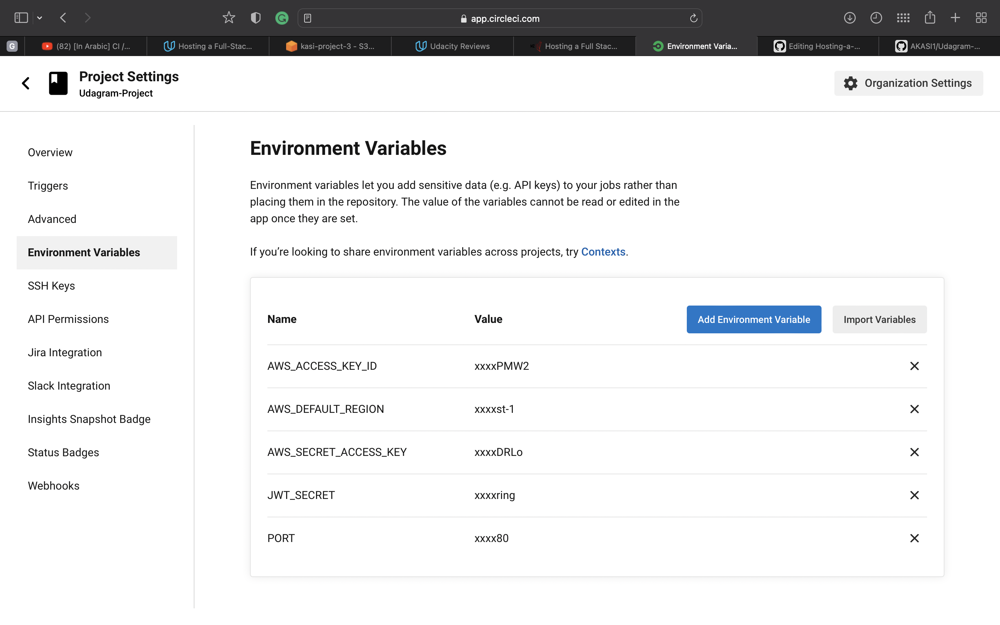
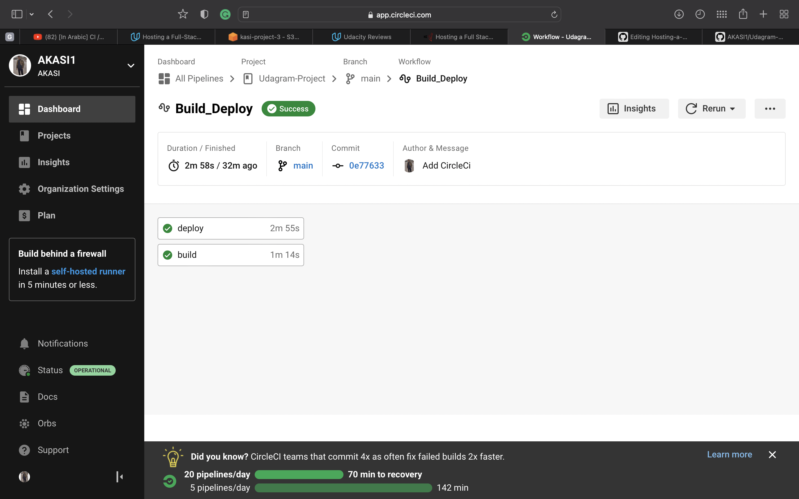

# Udagram Pipeline

## GitHub
The developers commit and push their code to the GitHub repository which is linked to the CircleCI platform.
GitHub triggers the CircleCI platform when code is pushed to the repository.

## CircleCI
CircleCI reads the `.circleci/config.yml` file which tells the service what has to be done. In the case of Udagram,
there are 2 jobs (frontend & server) to be run by CircleCI.

- **Frontend**: Runs the script in the `package.json` file. Then the command in `deploy.sh` will run to upload the frontend to S3 bucket.
- **API**: Runs the script in `package.json`to upload the archive file to deploy the server by AWS CLI.

### Environment Variables

### build in CircleCi

