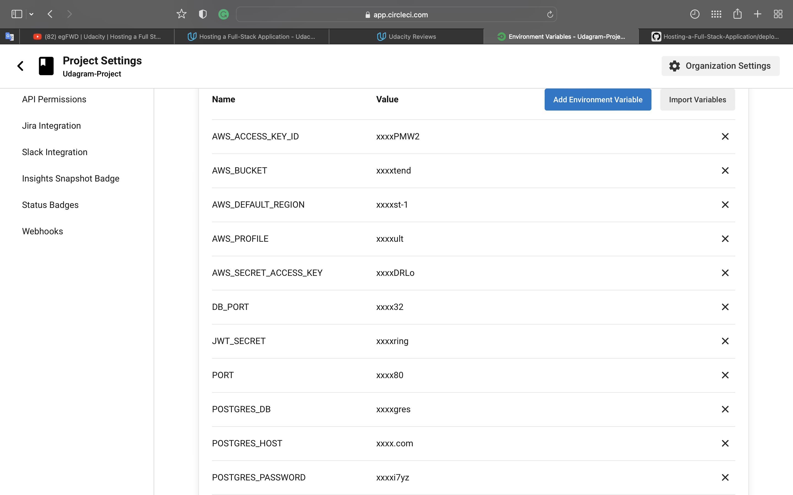

# CircleCI

CircleCI automatically runs the build and then deploy processes whenever the developer commit code, and then displays the build status in the GitHub branch.

- Frontend: Runs the script in the `package.json` file. Then the command in `deploy.sh` will run to upload the frontend to S3 bucket.
- API: Runs the script in `package.json`to upload the archive file to deploy the server by AWS CLI.

### Environment Variables

### build in CircleCi

